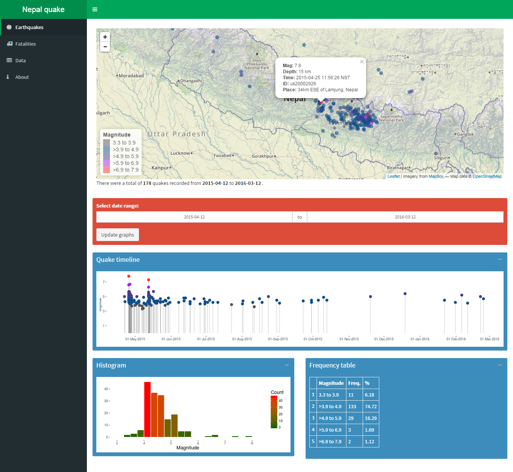

#About Nepal Quake dashboard

This is a simple implementation of Shiny dashboard to explore the [Nepal earthquake](http://en.wikipedia.org/wiki/April_2015_Nepal_earthquake) data. The earthquake data used here is NOT real-time. The data was downloaded from USGS (csv format) and can be updated by replacing the file in the data folder. To filter the quakes in the vicinity of Nepal, only the quakes within the bounding box of Nepal map are used.


<small>Screenshot of app's dashboard page</small>

You can try the app live at: [https://asheshwor.shinyapps.io/np-quake](https://asheshwor.shinyapps.io/np-quake). If this doesn't work it's probably the free server limit has been exceeded.

You can also run the app locally (if you have [RStudio](http://www.rstudio.com/) and [Shiny](http://cran.r-project.org/web/packages/shiny/index.html) installed) by using the following command.

```R
shiny::runGitHub('np-quake', 'asheshwor')
````

## Disclaimer

I am not an earthquake expert. This is not at an attempt to predict aftershock events.

## R packages used

*   shinydashboard
*   leaflet
*   dplyr
*   scales
*   ggplot2

## Source code

Full source code is available from the following github repo: [https://github.com/asheshwor/np-quake](https://github.com/asheshwor/np-quake)

## Attribution

**Earthquake data:** This app uses earthquake data from USGS http://earthquake.usgs.gov/earthquakes/feed/v1.0/csv.php  
 **Map data:** The maps are generated using [leaflet for R](https://rstudio.github.io/leaflet/). Map tiles from [Mapbox](https://www.mapbox.com/). Mapbox uses map data from [Open Street Maps](http://www.openstreetmap.org/).